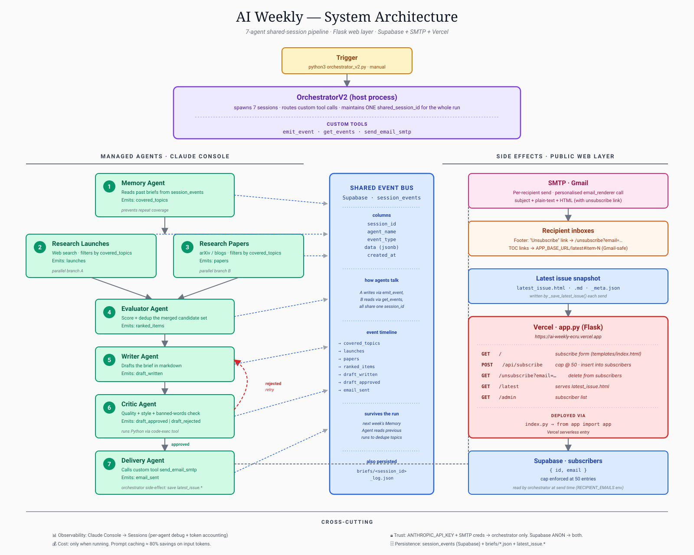

# AI Weekly

> Autonomous weekly AI newsletter generated end-to-end by 8 specialized Anthropic Managed Agents coordinating through a shared event-sourced session log. Ships every Thursday with zero manual intervention.

🌐 **Live:** [ai-weekly-ecru.vercel.app](https://ai-weekly-ecru.vercel.app) — subscribe form on the homepage
📰 **Latest issue:** [ai-weekly-ecru.vercel.app/latest](https://ai-weekly-ecru.vercel.app/latest)
📐 **Design docs:** [ARCHITECTURE.md](./ARCHITECTURE.md) · [DEPLOYMENT.md](./DEPLOYMENT.md)

---

## Architecture



> The diagram above reflects the v1 (7-agent) design. The current system has 8 agents — a Verifier was added between Critic and Delivery to ground every URL and arXiv citation against the live web before delivery. See [ARCHITECTURE.md](./ARCHITECTURE.md) for the current design.

---

## Key Results

| Metric | Value |
|--------|-------|
| Cost per run (steady state) | **$2.08** average; range $0.77 – $3.91 |
| Cache hit rate on Opus inputs | **83%** (automatic, via Anthropic prompt caching) |
| Silent agent-failure rate | **0%** (down from 33% in early runs after the placeholder fix) |
| Wall-clock per run | **8–11 minutes** |
| Total project spend | **$49.04** in Anthropic API credits across the entire project lifecycle |
| Time to working MVP on Managed Agents | **~3 days** (vs. estimated 2–3 weeks for an equivalent custom harness) |
| Lines of orchestration code | **~600** (vs. ~1,500 estimated for an equivalent custom harness) |

---

## What it does

Generates one issue of *The Weekly Signal* per run via a 6-step pipeline: **research → evaluate → write → critique → verify → deliver**. Runs every Thursday at 9am UTC on GitHub Actions. A small Flask app on Vercel handles the subscribe form, the `/latest` page, the `/admin` page, and the `/unsubscribe` link.

**Stack:** Anthropic Managed Agents (Opus 4.7 + Haiku 4.5) · Memory Stores (JSONL) · GitHub Actions · Flask + Vercel · Supabase · SMTP · Python 3.11.

---

## The 8 Agents

| # | Agent | Model | Role |
|---|-------|-------|------|
| 1 | Memory | Haiku 4.5 | Reads coverage from the previous 12 issues so the pipeline avoids repetition |
| 2 | Research Launches | Opus 4.7 | Finds significant AI ecosystem developments from the past 7 days |
| 3 | Research Papers | Opus 4.7 | Finds research papers an engineer or PM could act on in production |
| 4 | Evaluator | Opus 4.7 | Scores and ranks candidates against a structured rubric (relevance, depth, novelty) |
| 5 | Writer | Opus 4.7 | Drafts the brief in markdown with mandatory citations on every claim |
| 6 | Critic | Opus 4.7 | Reviews quality, structure, citations, banned words; can reject back to Writer |
| 7 | Verifier | Haiku 4.5 | HTTP HEAD-checks every URL in the approved draft; queries arXiv API for paper IDs; rejects on bad links |
| 8 | Delivery | Haiku 4.5 | Per-recipient HTML rendering with personalized unsubscribe; SMTP send |

All 8 agents coordinate through a single append-only event log stored in Anthropic Memory Stores at `/mnt/memory/session_{id}.jsonl`. Each agent emits its work as an event; downstream agents read prior events through custom tools, never through conversational context.

---

## Technical Decisions and Tradeoffs

The choices that materially shaped the system:

**JSONL event log instead of a database.** The session log is an append-only JSONL file. Streamable, trivially inspectable with `cat | jq`, zero schema migrations, portable to any storage backend. Tradeoff: no native indexes, but at ~30 events per run that does not matter.

**Treat the session as a database, not a context window.** Every agent's output is emitted as an event; downstream agents read events. Resume from crash, replay debugging, and cross-agent coordination all become straightforward consequences of state living outside the agents.

**Model tiering: Opus for judgment, Haiku for mechanics.** Three of the eight agents (Memory, Verifier, Delivery) run on Haiku 4.5; the other five run on Opus 4.7. Cuts ~40% off cost vs. all-Opus with no observable quality drop on the Haiku-assigned tasks.

**Per-tool retry policies, not global retry.** SMTP and filesystem failures have different error profiles, so each tool gets its own retry config. Memory store retries 3× with 0.5s backoff; SMTP retries 2× with 2s. Auth errors and 4xx fail immediately.

**Per-agent criticality classes.** Memory failing means the issue ships without covered topics; Delivery failing aborts the run. Optional failures continue the pipeline; critical failures stop it.

**Post-condition placeholder events (silent-failure defense).** In two of the first three production runs, the Research Papers agent silently exited without emitting its terminal event (no error, no timeout, no exception). The orchestrator now checks for the expected terminal event after each step and inserts a placeholder if missing. Silent failure rate dropped from 33% to 0%.

**Hallucination grounding via a dedicated Verifier agent.** Every URL in an approved draft is HTTP HEAD-checked against the live web; arXiv links are validated against the arXiv API by paper ID. Catches fabricated citations before they reach subscribers. Costs ~$0.02 per run.

**Structural contract between the Writer prompt and the email renderer.** The Writer's markdown output is parsed by `email_renderer.py` via regex. A late prompt change once silently broke the renderer (the email arrived empty under the section headers). Now enforced from both ends: the Writer prompt mandates the `### N. Title` format, the Critic rejects drafts that do not conform, and a renderer smoke test runs before any prompt change ships.

**GitHub Actions for orchestration, not Vercel Cron.** Vercel Hobby caps function execution at 60 seconds; the pipeline runs 8–15 minutes. GitHub Actions provides a 6-hour timeout for free with a single YAML config.

**Resume from any step via `--session-id`.** The Writer/Critic loop is state-driven (decides what to run next based on event counts in the session log), so resume always lands on the correct state, even mid-loop.

Full discussion in [ARCHITECTURE.md](./ARCHITECTURE.md).

---

## Running it

The system is **designed to run as a deployed service** (GitHub Actions cron + Vercel web layer), not as a local script. The orchestrator does run locally for development.

### Production (autonomous, every Thursday 9am UTC)

GitHub Actions triggers `python3 orchestrator_v2.py` on schedule. After a successful run, the workflow commits `latest_issue.html` back to the repo, which Vercel auto-deploys.

Manual trigger: GitHub Actions tab → "Newsletter Weekly Run" → "Run workflow".

Full setup in [DEPLOYMENT.md](./DEPLOYMENT.md).

### Local (development)

```bash
git clone https://github.com/pranamya123/ai-weekly.git
cd ai-weekly
pip install -r requirements.txt
cp .env.example .env   # fill in the keys below
python3 orchestrator_v2.py
```

Required env vars:

```bash
ANTHROPIC_API_KEY=sk-ant-...
SMTP_USER=you@gmail.com
SMTP_PASSWORD=...               # Gmail app password
SMTP_FROM=you@gmail.com
RECIPIENT_EMAILS=a@x.com,b@y.com   # fallback; live subscribers come from Supabase
APP_BASE_URL=https://your-domain.vercel.app
SUPABASE_URL=https://...
SUPABASE_ANON_KEY=...
LOCAL_MEMORY_DIR=./memory_local    # local fallback; production uses /mnt/memory
```

Resume a partial run:
```bash
python3 orchestrator_v2.py --session-id newsletter_20260507_090000_a1b2c3d4
```

Run a single step (debug):
```bash
python3 orchestrator_v2.py --session-id newsletter_... --step evaluate
```

Run the web layer locally:
```bash
python3 app.py   # http://127.0.0.1:5000
```

Inspect the most recent run:
```bash
python3 analyze_run.py
```

---

## Repo layout

```
orchestrator_v2.py              # Step-based orchestrator + AgentRunner
observability.py                # StructuredLogger + RunTracker
retry.py                        # Exponential backoff decorator
credentials.py                  # Credential manager
email_renderer.py               # Editorial HTML rendering
analyze_run.py                  # Post-run analysis helper
app.py                          # Flask web layer
index.py                        # Vercel entrypoint
tools/
  memory_store.py               # emit_event, get_events
  email.py                      # send_email_smtp
  subscribers.py                # get_subscribers (Supabase live fetch)
  verifier.py                   # verify_links (HTTP HEAD + arXiv API)
api/
  orchestrate.py                # (Vercel) Manual trigger
  step.py                       # (Vercel) Single-step runner
  status.py                     # (Vercel) Run status
.github/workflows/
  newsletter.yml                # GitHub Actions cron + manual trigger
ARCHITECTURE.md                 # Full design write-up
DEPLOYMENT.md                   # Setup instructions
architecture_diagram.svg        # One-page system diagram (v1, 7-agent)
```

---

## Limitations and future work

**Known limitations:**

- Built and tested at single-digit-subscriber scale; not yet load-tested at thousands of subscribers.
- No A/B testing on Writer prompts.
- No structured alerting beyond GitHub Actions email-on-failure.
- Per-agent token counts log as 0 (Anthropic SDK does not populate `usage` on the `session.status_idle` events the orchestrator captures). Total cost remains correct via the Anthropic billing dashboard.
- Verifier-failure retry path has a known bug: the loop short-circuits on the existing `draft_approved` event instead of forcing a new Writer attempt. Not hit in production yet, but worth fixing before relying on Verifier loops in higher-stakes pipelines.

**Future work:**

- **RAG over past issues** using Supabase pgvector, to give the Memory agent semantic dedup rather than string matching. Today nothing catches that "Anthropic's flagship release" and "Claude 4 launches" describe the same event.
- **GitHub MCP** for the Research Launches agent, giving it structured access to live repo data (star counts, commit activity, recent releases) rather than web-search snippets.
- **Public run-history endpoint** reading from `runs/*.json` for cost and timing trends over time.

---

## Read more

- **Architecture deep-dive:** [ARCHITECTURE.md](./ARCHITECTURE.md)
- **Deployment guide:** [DEPLOYMENT.md](./DEPLOYMENT.md)
- **Technical writeup:** *coming soon — Medium article link will be added once published*

---

## Contact

Built by [Pranamya Vadlamani](https://www.linkedin.com/in/pvadlamani1/). Currently looking for Applied AI Engineer / Forward Deployed Engineer roles. If you are hiring for that kind of work or want to chat about the project, reach out on LinkedIn.

---

## License

MIT.
